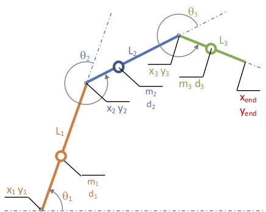
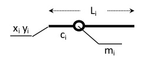
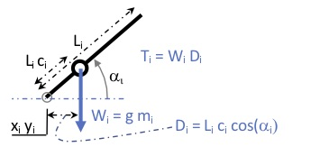
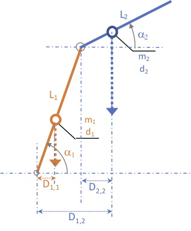
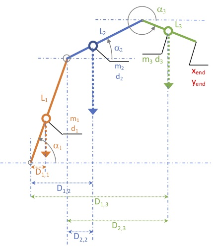

# GravityTorques-3Links-2D
Geometry and joints torques of a 3-links system in a gravity field in 2D

## Usage

## Geometry  
The graphical representation below shows a 3-links kinematic chain.  



With more details, we decide that : 
* Links are rigid bodies fully defined by :
	* L<sub>i</sub> : Total length (meter)
	* c<sub>i</sub> : location of the centre of mass from the root of the link (percentage) 
	* m<sub>i</sub> : mass (kilogram)
	* x<sub>i</sub> y<sub>i</sub> : absolute coordinates of the root of the link (real)  
	  
* Link orientation are defined by : 
	* &theta;<sub>i</sub> : relative to the previous link  
	NOTE : this is the convention for a *kinematic chain*, where angles 
	(&theta;<sub>i</sub>) are counter clockwise *from previous segment*.   
	* &alpha;<sub>i</sub> : relative to the gravity field  
	NOTE : &alpha;<sub>i</sub> = &theta;<sub>1</sub> + ... + &theta;<sub>i</sub>
## Torque 
We pedagogically describe the logic for a kinematic chain with 1 to N links. 
### For a single link:   
To compute the torque for a single link, we define : 
* W<sub>i</sub> : gravitation force (newton)
	* W<sub>i</sub> = g m<sub>i</sub> 
* D<sub>i</sub> : lever arm of W<sub>i</sub> (meter) 
	* D<sub>i</sub> = (L<sub>i</sub> c<sub>i</sub>) cos(&alpha;<sub>i</sub>)  
* &alpha;<sub>i</sub> : angle relative to the gravity field (radian)
* T<sub>i</sub> : torque due to gravity (newton meter) 
	* T<sub>i</sub> = D<sub>i</sub> W<sub>i</sub> = g m<sub>i</sub> c<sub>i</sub> cos(&alpha;<sub>i</sub>)  

  

### For two links:   
To compute the torque for two links, we have to take care that the kinematic chain has 
two axes of rotation, as illustrated in the figure below.   

  

We define :
* J<sub>i</sub> : joint (axis of rotation) of link<sub>i</sub>. 
	* In a kinematic chain, the joint J<sub>i</sub> articulates link<sub>i-1</sub> to link<sub>i</sub> 
	* Joint<sub>i</sub> is located at (x<sub>i</sub>, y<sub>i</sub>) 
	* Joint<sub>1</sub> is the root of the kinematic chain 
* T<sub>Joint,Link</sub> : torque due to link L at joint J (newton meter)   
For example (see figure below): 
	* T<sub>1,2</sub> : torque due to link 2 around the root joint 
	* T<sub>1,12</sub> : torque due to links 1+2 around the root joint 
	* T<sub>2,2</sub> : torque due to link 2 around joint 2
 
With these notations, we get : 
* Torque around axis 1 (root): 
	* T<sub>1,1</sub> = g m<sub>1</sub> D<sub>1,1</sub> 
    	* with D<sub>1,1</sub>= L<sub>1</sub> c<sub>1</sub> cos(&alpha;<sub>1</sub>) 
	* T<sub>1,2</sub> = g m<sub>2</sub> D<sub>1,2</sub>,  
    	* with D<sub>1,2</sub> = L<sub>2</sub> c<sub>2</sub> cos(&alpha;<sub>2</sub>) + 
    	L<sub>1</sub> cos(&alpha;<sub>1</sub>)
	* T<sub>0,12</sub> = T<sub>0,1</sub> + T<sub>0,2</sub>  
* Torque around axis 2 (partial torque at (x<sub>2</sub> y<sub>2</sub>)):   
	* T<sub>2,2</sub> = g m<sub>2</sub> D<sub>1,2</sub> 
		* with D<sub>2,2</sub> = L<sub>2</sub> c<sub>2</sub> cos(&alpha;<sub>2</sub>)

Lever arms D<sub>Joint,Link</sub> and gravity forces W<sub>Link</sub> are illustrated below. 

   

### For three links:   
Generalisation from the previous simpler cases gives:

* Distances (lever arm of the weight):  
D<sub>1,1</sub> = L<sub>1</sub> c<sub>1</sub> cos(&alpha;<sub>1</sub>)   
D<sub>1,2</sub> = L<sub>2</sub> c<sub>2</sub> cos(&alpha;<sub>2</sub>) + 
    L<sub>1</sub> cos(&alpha;<sub>1</sub>)  
D<sub>1,3</sub> = L<sub>3</sub> c<sub>3</sub> cos(&alpha;<sub>3</sub>) + 
    L<sub>2</sub> cos(&alpha;<sub>2</sub>) +
    L<sub>1</sub> cos(&alpha;<sub>1</sub>)
        
* Torques :  
T<sub>1,1</sub> = g m<sub>1</sub> D<sub>0,1</sub>  
T<sub>1,2</sub> = g m<sub>2</sub> D<sub>0,2</sub>  
T<sub>1,3</sub> = g m<sub>3</sub> D<sub>0,3</sub>  
        
* Total torque :  
T<sub>1,123</sub> = T<sub>0,1</sub> + T<sub>0,2</sub> + T<sub>0,3</sub>

* Partial torques:  
The torques of interest are that of the distal part of the kinematic chain, so to get the
gravitational torque at each joint.
    * Last link acting on the last joint:  
T<sub>3,3</sub> = g m<sub>3</sub> D<sub>2,3</sub>, with 
	D<sub>3,3</sub> =  L<sub>3</sub> c<sub>3</sub> cos(&alpha;<sub>3</sub>)  
    * Last two links acting on joint 1 (the root is joint 0):  
T<sub>2,23</sub> = T<sub>2,2</sub> + T<sub>2,3</sub>  
T<sub>2,23</sub> = g m<sub>2</sub> D<sub>2,2</sub> + g m<sub>3</sub> D<sub>2,3</sub>, with  
	    * D<sub>2,2</sub> = L<sub>2</sub> c<sub>2</sub> cos(&alpha;<sub>2</sub>)   
        * D<sub>2,3</sub> = L<sub>2</sub> cos(&alpha;<sub>2</sub>) + L<sub>3</sub> c<sub>3</sub> cos(&alpha;<sub>3</sub>) 
     
The figure below illustrates such a 3 links system, showing the &alpha;<sub>i</sub> and D<sub>Joint, Link</sub> 


   

### For N links:   
To compute the torque for N links, we generalize the previous by exploiting the 
regularities in the equations.  
* Constraints on formulas (i.e., this is a kinematic chain)
	* Link must be distal relative to joint (L >= J) in:   
		* T<sub>Joint,Link</sub> 
		* D<sub>Joint,Link</sub>  
* Regularities in lever arm formula:  
The lever arm of link L relative to joint J is the sum of lever arms along the corresponding 
part of the kinematic chain.  
D<sub>Joint,Link</sub> = &Sigma; D<sub>J,i</sub> with i varying from J to L
	* Last link (most distal part of the kinematic chain): D<sub>J,last</sub> = L<sub>last</sub> c<sub>last</sub> cos(&alpha;<sub>last</sub>)
	* Other link (not distal part of the kinematic chain): D<sub>J,i</sub> = L<sub>i</sub> cos(&alpha;<sub>i</sub>)
* Regularities in torque formula:  
 	* Invariance overs links and joints. 
		* T<sub>J,J...L</sub> = &Sigma; T<sub>J,i</sub> with i varying from J to L
		* T<sub>J,i</sub> =  g m<sub>i</sub> D<sub>J,i</sub>

## Implementation in matlab:   
Here, we will keep data structure as straightforward as possible, and we will not use object programming. 


### Data to describe the kinematic chain  
Each link is totally described once we know : total length (meter), angle from horizontal 
(degrees, easier for humans eyes), position of the CoM (percent, from link root) and mass 
(kg). Below are plausible data values for a human body (profile view) : 
```matlab
%      trunk    arm   forearm
L = [  0.75,   0.35,    0.25  ]; % total length (meter)
a = [    90,    -70,       0  ]; % alpha from horizontal (degrees, easier for humans eyes)
d = [  0.45,   0.45,    0.55  ]; % position of CoM (percent)
m = [    20,    1.1,     0.9  ]; % mass (kg)

alpha = a .* pi ./ 180;          % alpha in radian (for computations)
```
This allows for calls such as:  
`D1_3 = L(3) .* c(3) .* cos( alpha(3) ) + L(1:2) .* alpha(1:2) ; `  
to implement  
D<sub>1,3</sub> = L<sub>3</sub> c<sub>3</sub> cos(&alpha;<sub>3</sub>) + 
    L<sub>2</sub> cos(&alpha;<sub>2</sub>) +
    L<sub>1</sub> cos(&alpha;<sub>1</sub>)


### Relations between angles in the kinematic chain  
Angles &theta; and &alpha; have relations that we can exploit. By definition:  
* &theta; is the relative orientation of one segment (relative to the previous) 
* &alpha; is the absolute orientation of one segment (relative to horizontal)

Hence: 
* &theta; is the difference in &alpha; (change/derivative of &alpha;)
* &alpha; is the sum of all previous &theta;  (sum/integration of &theta;)
```matlab
% Relations between angles: 
theta = [alpha(1) diff(alpha)];  % difference in alpha 
alpha = cumsum(theta);           % sum of previous theta

```
### Cartesian coordinates of the links 
Once defined the coordinate of the root of the kinematic chain, the distal coordinate of 
each segment is given by L cos(&alpha;). 

```matlab
xEndLink = cumsum(L .* cos(alpha));  % end of all links 
yEndLink = cumsum(L .* sin(alpha));	
xEndEffector = xEndLink(end);        % end effector position
yEndEffector = yEndLink(end); 
x = xEndLink(1:end-1);               % end of previous link = beg of current link
y = yEndLink(1:end-1); 
x = [0, x];                          % add first link
y = [0, y]; 
x = xRoot + x;                       % shift all by Root coordinate
y = yRoot + y; 
```

### Lever arm computation  
The lever arm from joint j to the CoM of link l is given by the sum of :
* the distance from the axis of rotation to the root of the link : &Sigma; L cos(&alpha;)
* the distance from the root of the link to the CoM : L c cos(&alpha;)

```matlab
ShiftLnk = L .* cos(alpha); 
ShiftCoM = L .* c .* cos(alpha); 
LA = sum(ShiftLnk(j:l-1)) + ShiftCoM(l);
```
### Torque computation  
The torque due to gravity at joint is the sum of the torques due to the *distal* links. 
```matlab
for j = 1:NbLinks                                 % for each joint... 	
    T(j) = 0;                                     % init torque at this joint
    for l = j:NbLinks                             % for the distal links...		
    	LA = sum(ShiftLnk(j:l-1)) + ShiftCoM(l);  % lever arm (of each link)
    	Tl = LA .* g .* m(l);                     % torque (of each link)
    	T(j) = T(j) + Tl;                         % sum torques (of each link)
    end
end 
```
## Implementation logic 
To ease the manipulation of the previous calculations, we organize things a bit. 
We define a structure that stores all data needed to describe the "posture" of the system. 
As we do not use object programming, we create functions to manipulate this data 

* Posture related functions: 
	* To create the posture (from the minimal information):  
	`P = Posture_set(L, a, c, m, xRoot, yRoot)`  
	
	* To conpute the gravity torques (knowing the configuration of the links):  
	`P = Posture_setGravityTorques(P)`  
	
	* To move the posture to a novel configuration (with a novel theta1):  
	`P = Posture_moveTheta1(P, theta1)`  
	
	* To display the posture  
	`Posture_plot(P)`  
	
	* To compute the torques   
	`P = Posture_setGravityTorques(P)`  

* Definition of the kinematic chain  
We manually specify the minimal information necessary to display the chain and compute 
gravitational torques. 
```matlab
	% define root position 
	xRoot = 10;  yRoot = 0;           
	% define links 
	%      first  second    third
	L = [  0.75,   0.35,    0.35   ]; % length in meter
	a = [    90,    -70,       0   ]; % angle from horizontal in degrees
	c = [  0.45,   0.45,    0.55   ]; % position of COM in percent
	m = [    20,    1.1,     0.9   ]; % mass in kg
```

* Initialisation of the posture struct  
From the minimal definition, we compute the coordinates of the links and the torques, and 
we store that into a "posture" struct. 
```matlab
	P = Posture_set(L, a, c, m, xRoot, yRoot)
		% L : length of links (meter) 
		% a : angle of links (degree) 
		% m : mass of links (kilogram) 
		% c : distance of center of mass (percentage)
		% xRoot, yRoot : coordinates of the root of the chain
	
	P = 
	    Length: [0.7500 0.3500 0.4500]
	       CoM: [0.4500 0.4500 0.5500]
	      Mass: [20 1.1000 0.9000]
	         x: [10 10 10.1197 10.5697]
	         y: [0 0.7500 0.4211 0.4211]
	     theta: [1.5708 -2.7925 1.2217]
	    nLinks: 3
	    Torque: [3.8234 3.8234 2.1852]
```
* Modification of the first link orientation    
Without changing the end effector position, we can change the orientation of the first link . 
```matlab
	P = Posture_moveTheta1(P, theta1)
		% P : a posture struct (as provided by Posture_set) 
		% theta1 : angle of the first link (degree) 
```

* Display of a posture struct  
Accurate plot of a posture is necessary for visualisation
```matlab
	Posture_plot(P)
		% P : a posture struct (as provided by Posture_set) 
```


# Todo
## Adding a mass to the endpoint:   
This can be done by adding a 4th link, following the very same logic.  
This link 4 would have non-zero mass, but zero for other dimensions:  
L<sub>4</sub> = 0, &alpha;<sub>4</sub> = 0, c<sub>4</sub> = 0 but m<sub>4</sub> is non-zero. 

## Target position of end effector 
End-effector (endpoint) position is fixed at the target position, but the user can 
interactively modify the angle of the first link. 
* A clic (or a slider) can change &alpha;<sub>1</sub>
	* the geometric constraints are pictured 
	* &alpha;<sub>1</sub> should stay in a range allowing the reach

